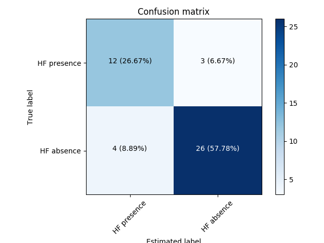
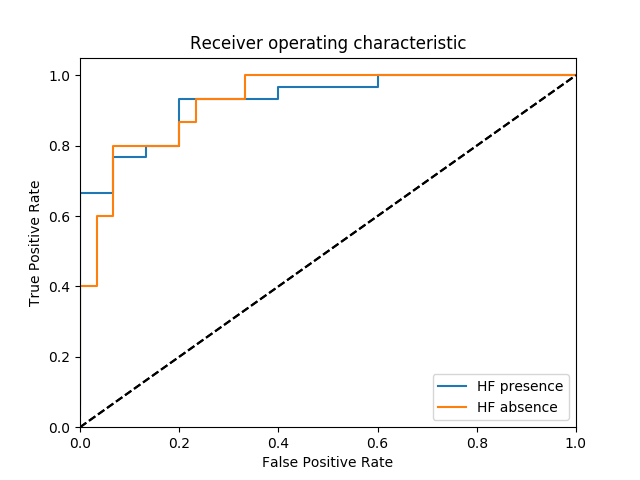
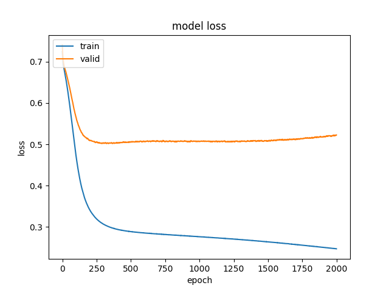

# 2018 - IDSS PW3

Group 3

Reference: O.W. Samuel, G.M. Asogbon, A.K. Sangaiah, P. Fang, G. Li (2017) - An integrated decision support system based on ANN and Fuzzy_AHP for heart failure risK prediction. Expert Syst. Appl. 68, 163-172.

## Intro
- [requirement.txt](requirement.txt) : list which packages used in this project.

- [setup.py](setup.py) : for packing up all.
- [main.py](main.py) : integrate all function and add user interface.
- [test.py](test.py) : integrate all function for testing each function.
- [preprocessing.py](preprocessing0.py) : load data and deal with missing data.
- [faphy.py](faphy.py) : Fuzzy_AHP using pairwise_matrix to get the attribute's weights.
- [ann.py](ann.py) : train ANN to trained ANN for prediction.
- [eval.py](eval.py) : evaluate the model, using sensitivity/specificity, evaluation metrics, ROC and performance plot.

data/ :
  - processed_data.csv : [original dataset from UCI data repository](http://archive.ics.uci.edu/ml/datasets/heart+Disease).
  - weights : attribute's weights computed from Fuzzy_AHP.
  - ANNmodel.h5 : the ANN model information (including frame and weights).

image/ : store all images using in README.md
   

## Infrastructure

## Result

- Programming Output 
  
  
- Plot Curve 
  
  

## Evaluation

(left: hybrid method, right: conventional ANN method) 

- evaluation metrics 
  
  

- ROC 
  
  

- performance plot 
  
   
    
    |            | hybrid method  | conventional ANN method  |
    |:----------:|---------------:|-------------------------:|
    | Train Accuracy |   83.67%      |  87.25%                    |
    | Test Accuracy  |   91.11%      |  84.44%                    |
    |Sensitivity |  93.33%       |  86.67%                     |
    |Specificity |  86.67%     |  80.00%                     |
    | FP rate   |  13.33%        |  20.00%                     |
    | FN rate   |  6.67%        |  13.33%                      |
    | Recall    |  93.33%         |  86.67%                    |
    | Precision |  93.33%       |  89.66%                    |
    | F1        |  93.33%       |  88.14%                    |

## Comparison

seed = 2, batch_size = 50, iteration=2000, 

| X(attribute) scale   |  missing data  | attribute weight  |  fix attribute w    |  ANN      |  test acc(train acc)  |
|:--------------------:|:--------------:|:-----------------:|:-------------------:|-----------|----------------------:|
| min-max              |  replace_mean  |  √               |  √                   | 13-10-2   |   89.13% (84.82%)     |
| normalization        |  replace_mean  |  √               |  √                   | 13-10-2   |   89.13% (84.05%)     |
| min-max              |  replace_med   |  √               |  √                   | 13-10-2   |   89.13% (84.82%)     |
| normalization        |  replace_med   |  √               |  √                   | 13-10-2   |   89.13% (84.44%)     |
| min-max              |  MICE          |  √               |  √                   | 13-10-2   |   89.13% (84.82%)     |
| normalization        |  MICE          |  √               |  √                   | 13-10-2   |   89.13% (84.44%)     |
| min-max              |  knn-1         |  √               |  √                   | 13-10-2   |   89.13% (84.82%)     |
| normalization        |  knn-1         |  √               |  √                   | 13-10-2   |   89.13% (84.05%)     |
| min-max              |  knn-3         |  √               |  √                   | 13-10-2   |   89.13% (84.82%)     |
| normalization        |  knn-3         |  √               |  √                   | 13-10-2   |   89.13% (84.05%)     |
| min-max              |  x             |  √               |  √                   | 13-10-2   |   **91.11%** (83.67%) |
| normalization        |  x             |  √               |  √                   | 13-10-2   |   88.89% (86.45%)     |
| x                    |  x             |  √               |  √                   | 13-10-2   |   88.89% (87.25%)     |
| min-max              |  x             |  x               |  √                   | 13-10-2   |   **84.44%** (87.25%) |
| min-max              |  x             |  √               |  √                   | 13-10-1   |   % (%)     |

## TO-DO List

- [ ] No-fixed attribute weight
- [x] missing data treatment
- [x] Evaluation
- [x] Integrate 'missing data treatment'
- [ ] User Interface
- [ ] Pack project to .exe
- [ ] [Word](https://docs.google.com/document/d/1eVly1WEBN5DUt3R2okgRJKMU7RMSDm8R6JkDb2FgmsM/edit)
- [ ] Slides
