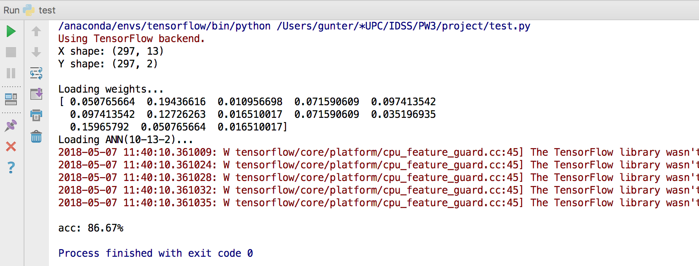
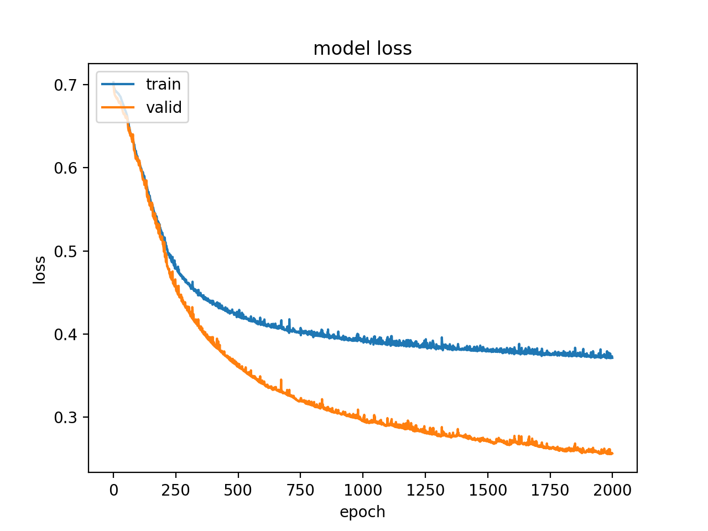
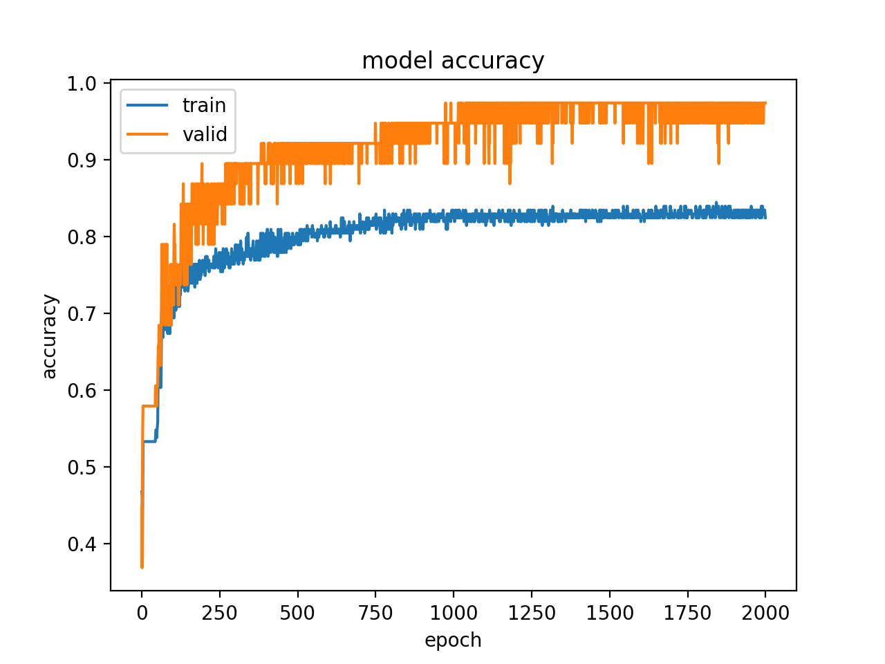

# 2018 - IDSS PW3

Group 3

Implement **An integrated decision support system based on ANN and Fuzzy_AHP for heart failure risk prediction**.

## Intro
- [requirement.txt](requirement.txt) : list which packages used in this project.

- [setup.py](setup.py) : for packing up all.
- [main.py](main.py) : integrate all function and add user interface.
- [test.py](test.py) : integrate all function for testing each function.
- [preprocessing.py](preprocessing.py) : load data and deal with missing data.
- [faphy.py](faphy.py) : Fuzzy_AHP using pairwise_matrix to get the attribute's weights.
- [ann.py](ann.py) : train ANN to trained ANN for prediction.
- [eval.py](eval.py) : evaluate the model, using sensitivity/specificity, evaluation metrics, ROC and performance plot.

- data
    - processed_data.csv : [original dataset from UCI data repository](http://archive.ics.uci.edu/ml/datasets/statlog+(heart)).
    - weights : attribute's weights computed from Fuzzy_AHP.
    - ANNmodel.h5 : the ANN model information (including frame and weights).
    

## Result

Programming Output 

Plot Curve 

## Evaluation